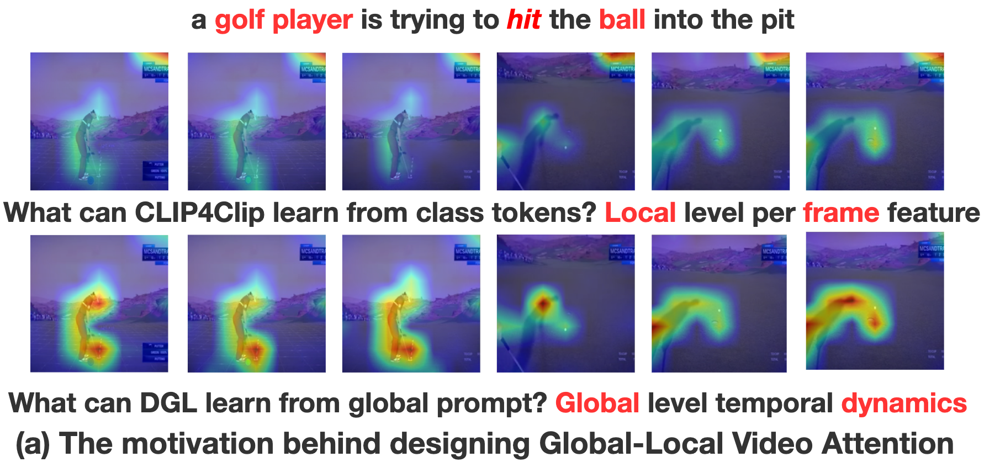
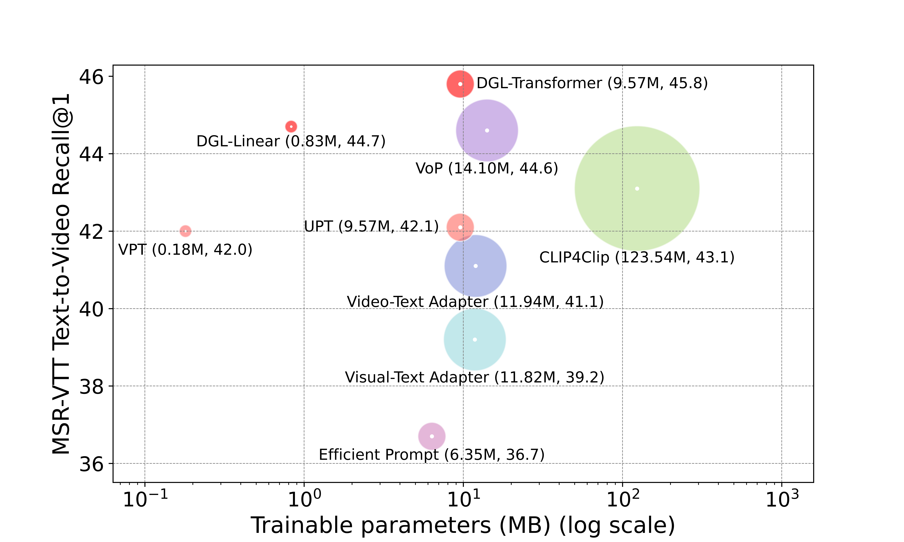
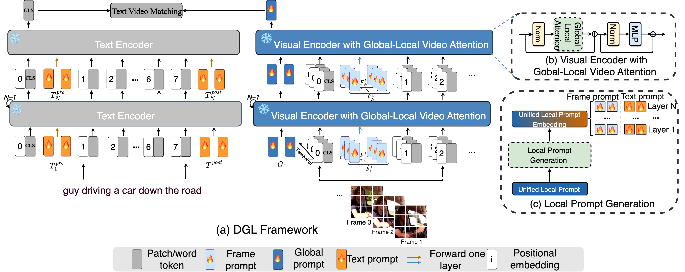
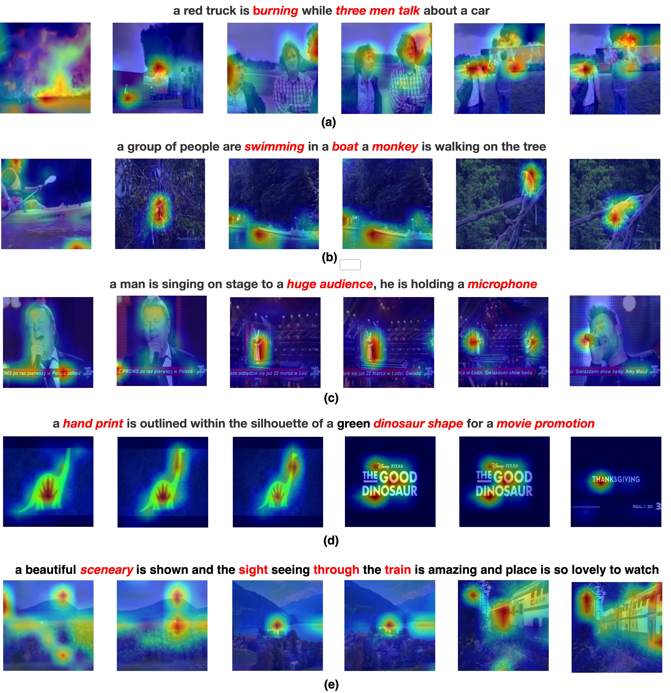
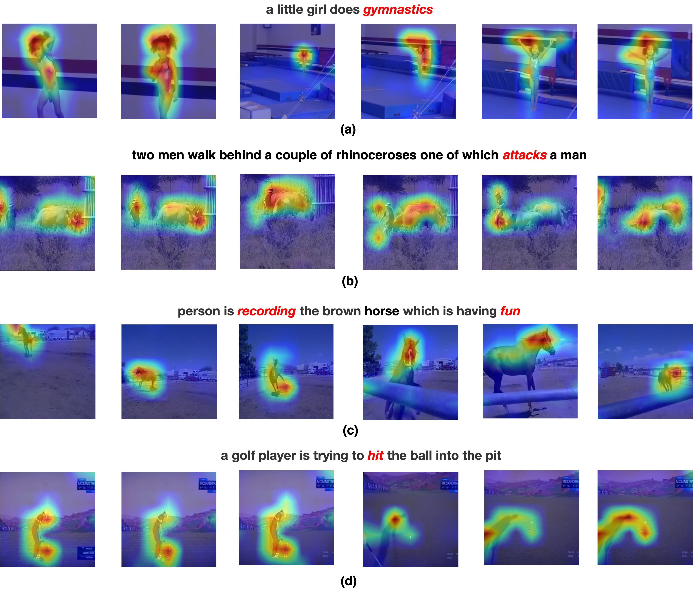

<div align="center">
  
# 【AAAI'2024 🔥】DGL: Dynamic Global-Local Prompt Tuning for Text-Video Retrieval
[](https://aaai.org/aaai-conference/)
[](https://arxiv.org/abs/2401.10588)
</div>

The official implementation of AAAI24 paper [DGL:Dynamic Global-Local Prompt Tuning for Text-Video Retrieval](https://arxiv.org/abs/2401.10588)


##  Table of Contents

<!--ts-->
* [Citation](#-citation)
* [Updates](#-updates)
* [Overview](#-overview)
* [Method](#-method)
* [Visualization](#-visualization)
* [Quick Start](#-quick-start)
* [Test](#test)
* [Train](#train)
<!--te-->

## 📌 Citation
If you find this paper useful, please consider staring 🌟 this repo and citing 📑 our paper:
```
@inproceedings{yang2024dgl,
    title={DGL: Dynamic Global-Local Prompt Tuning for Text-Video Retrieval}, 
    author={Xiangpeng Yang and Linchao Zhu and Xiaohan Wang and Yi Yang},
    booktitle={AAAI},
    year={2024}
}
```


## 📣 Updates
* Feb 15 2024: Release the code of DGL. 


## 📕 Overview

<div align="justify">
Text-video retrieval is a critical multi-modal task to find the most relevant video for a text query. Although pretrained models like CLIP have demonstrated impressive potential in this area, the rising cost of fully finetuning these models due to increasing model size continues to pose a problem. To address this challenge, prompt tuning has emerged as an alternative. However, existing works still face two problems when adapting pretrained image-text models to downstream video-text tasks: (1) The visual encoder could only encode frame-level features and failed to extract global-level general video information. (2) Equipping the visual and text encoder with separated prompts failed to mitigate the visual-text modality gap. To this end, we propose DGL, a cross-modal Dynamic prompt tuning method with Global-Local video attention. In contrast to previous prompt tuning methods, we employ the shared latent space to generate local-level text and frame prompts that encourage inter-modal interaction. Furthermore, we propose modeling video in a global-local attention mechanism to capture global video information from the perspective of prompt tuning. Extensive experiments reveal that when only 0.67% parameters are tuned, our cross-modal prompt tuning strategy DGL outperforms or is comparable to fully finetuning methods on MSR-VTT, VATEX, LSMDC, and ActivityNet datasets. 

<p align="center">
  
  
</p>

## 📚 Method

<div align="center">
  
</div>


## 😍 Visualization
### DGL can extract global information (bottom) and temporal dynamics (top)
<div align="center">

</div>


<details>
<summary><b>More examples for global information and temporal dynamics </b></summary>
  
### global information
<div align=center>

</div>

### temporal dynamics
<div align=center>

</div>
</details>


## 🚀 Quick Start

### Setup Setup conda environment
```
conda env create -f environment.yml
```

### Download CLIP Model
Download CLIP pre-trained weights and place them in `${HOME}/models/pretrained`.

```
wget https://openaipublic.azureedge.net/clip/models/40d365715913c9da98579312b702a82c18be219cc2a73407c4526f58eba950af/ViT-B-32.pt
```

### Download Datasets

MSR-VTT
Download the splits and captions from CLIP4clip:
```
wget https://github.com/ArrowLuo/CLIP4Clip/releases/download/v0.0/msrvtt_data.zip
```
Download the videos from Frozen️-in-Time:
```
wget https://www.robots.ox.ac.uk/~maxbain/frozen-in-time/data/MSRVTT.zip
```


### Prepare data

Video preprocessing can be done by [preprocess/compress_video.py](preprocess/compress_video.py).
```
python preprocess/compress_video.py --input_root [raw_video_path] --output_root [compressed_video_path]
```
This script will compress the video to *3fps* with width *224* (or height *224*). Modify the variables for your customization.


## Test

### Model Zoo
Note that, due to hardware difference, the results may slightly differ. 
We have test the performance on A100 GPU with T2V/V2T R@1 is 45.8/43.5
[log](https://drive.google.com/file/d/1C7o1snkZoJWoD2nqVpNIzl-X_kk_MEgm/view?usp=sharing),
on A6000 GPU with T2V/V2T R@1 is 45.4/44.1 
[log](https://drive.google.com/file/d/1iS38p9CZ0phpYeDw8KKRM5wWp885DWrY/view?usp=sharing).

You can also only adapt global-local video attention with BLIP, following the implementation of [tokenmix](https://github.com/yuqi657/video_language_model) , 
you can get T2V/V2T R@1 is 48.9/49.0 [log](https://drive.google.com/file/d/1y49uFJEzFiWNyFY4XJFUbNZsOJHK3cfY/view?usp=drive_link).

<div align=center>

|Checkpoint|CLIP|Shared Latent Space|Google Cloud|
|:--------:|:--------------:|:--------------:|:--------------:|
| MSR-VTT|ViT-B/32|Transformer| [Download](https://drive.google.com/file/d/1QZ4a9p1GJ20W418Njl_j1GJVyTLWiY17/view?usp=sharing) | 
| MSR-VTT|ViT-B/16|Transformer| [Download](https://drive.google.com/file/d/1DSxSk07AykbEiV8_qYP90bd0HEBfV3tN/view?usp=sharing) | 
| VATEX |ViT-B/32|Linear|[Download](https://drive.google.com/file/d/10fW99Bce5172jubQkX52l75zsBTR8GMV/view?usp=sharing) |  
| LSMDC |ViT-B/32|Linear|[Download](https://drive.google.com/file/d/1UfzjBuMkfimqg5A6CAV7EDvzb_pU3N7Q/view?usp=sharing) |  
| ActivityNet |ViT-B/32|Transformer|[Download](https://drive.google.com/file/d/13UG-oW7Kc8dzbUUmqcuWySSX3mCn-L6G/view?usp=sharing) | 
</div>

```
#eval in MSRVTT
#set
do_train=0
do_eval=1
shared_latent_space=transformer/linear
resume='path of ckpt.best.pth.tar'

bash scripts/msrvtt.sh
```

## Train
```
#set
shared_latent_space=transformer/linear

#For DGL-Linear, your can only training with 0.83 MB parameters.

#MSR-VTT
scripts/msrvtt.sh

# VATEX
scripts/vatex.sh

# LSMDC
scripts/lsmdc.sh

# ActivityNet
scripts/activitynet.sh
```


## Acknowledgements

This repo is built upon these previous works.

<!--ts-->
* [mzhaoshuai/CenterCLIP](https://github.com/mzhaoshuai/CenterCLIP)
* [ArrowLuo/CLIP4Clip](https://github.com/ArrowLuo/CLIP4Clip)
* [jpthu17/DiffusionRet](https://github.com/jpthu17/DiffusionRet)
* [jpthu17/HBI](https://github.com/jpthu17/HBI)

<!--te-->